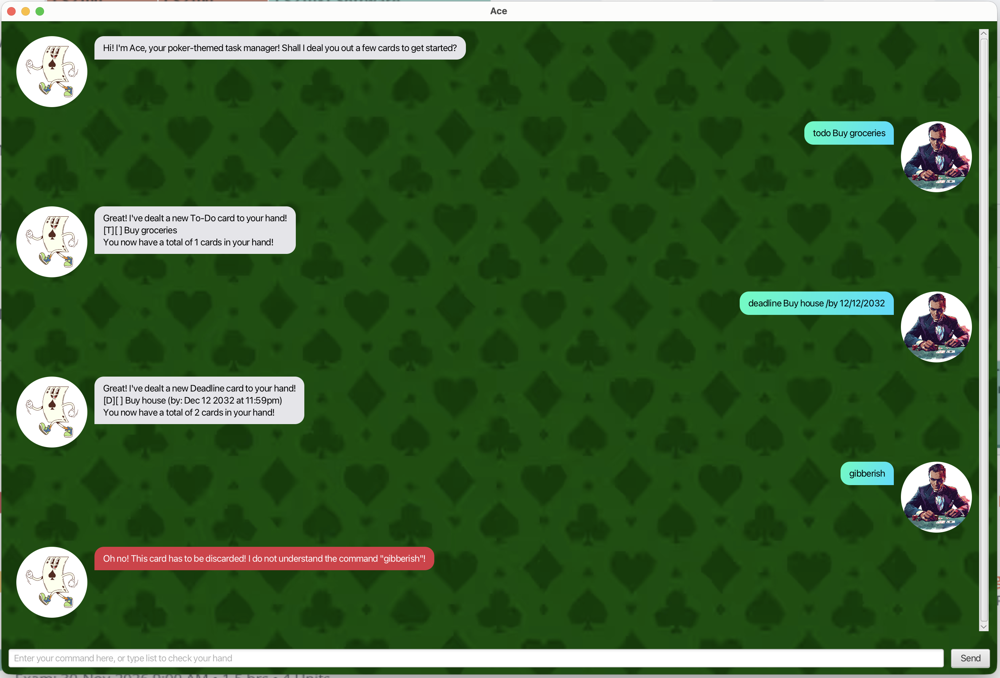

# Ace User Guide

Ace is a desktop app for managing your tasks. Ace speaks in a poker theme: your tasks are "cards" in your "hand."



## Quick Start

1. Ensure you have **Java 25** installed on your computer. (This project was built and tested with the Azul Zulu FX-bundled distribution, `25.0.3.fx-zulu`, but any Java 25 or later JDK should run the packaged jar, since it bundles its own JavaFX.)
2. Download the latest `Ace.jar` from the releases page.
3. Copy the file to the folder you want to use as the *home folder* for Ace — Ace saves its data relative to whichever folder you run it from, so open a terminal in that folder before running it, rather than double-clicking the jar.
4. In that terminal, run:
   ```
   java -jar Ace.jar
   ```
   The GUI should appear in a few seconds, along with a welcome message from Ace.
5. Type a command into the text box at the bottom and press Enter, or click **Send**. e.g. typing **`todo read book`** and pressing Enter adds a To-Do card titled "read book" to your hand.
6. Refer to the [Features](#features) below for details of every command.

## Notation used in this guide

* Words in `UPPER_CASE` are parameters you supply.
  e.g. in `todo DESCRIPTION`, `DESCRIPTION` is a parameter you supply, such as `todo read book`.
* `INDEX` always refers to the number shown next to a card in the output of `list` (1-based).

## Features

### Adding a todo: `todo`

Deals a simple to-do task as a card to your hand. A todo is a task with a description but no date or time attached.

Format: `todo DESCRIPTION`

Example:
```
todo read book
```
Ace replies:
```
Great! I've dealt a new To-Do card to your hand!
[T][ ] read book
You now have a total of 1 cards in your hand!
```

### Adding a deadline: `deadline`

Deals a card with a description and a due date/time to your hand.

Format: `deadline DESCRIPTION /by DATE`

> [!NOTE]
> `DATE` accepts any of the following formats:
> * `d/M/yyyy HHmm` — e.g. `2/12/2019 1800`
> * `yyyy-MM-dd HHmm` — e.g. `2019-12-02 1800`
> * `d/M/yyyy` (date only) — e.g. `2/12/2019`, which defaults the time to `11:59pm`
>
> Calendar-invalid dates (e.g. `30/2/2019`, since February never has 30 days) are rejected.

Example:
```
deadline return book /by 2/12/2019 1800
```
Ace replies:
```
Great! I've dealt a new Deadline card to your hand!
[D][ ] return book (by: Dec 02 2019 at 6:00pm)
You now have a total of 2 cards in your hand!
```

### Adding an event: `event`

Deals a card that spans a start time and an end time to your hand.

Format: `event DESCRIPTION /from START /to END`

> [!NOTE]
> `START` and `END` are free-form text. Ace doesn't try to parse them as real dates/times, so anything you type (`5pm`, `Mon 2pm`, `next Tuesday morning`) is accepted and shown back exactly as typed.

Example:
```
event project meeting /from Mon 2pm /to 4pm
```
Ace replies:
```
Great! I've dealt a new Event card to your hand!
[E][ ] project meeting (from: Mon 2pm to: 4pm)
You now have a total of 3 cards in your hand!
```

### Listing all cards: `list`

Shows every card currently in your hand, numbered from 1.

Format: `list`

Example output:
```
 1.[T][ ] read book
 2.[D][ ] return book (by: Dec 02 2019 at 6:00pm)
 3.[E][ ] project meeting (from: Mon 2pm to: 4pm)
```
If your hand is empty, Ace replies `Your hand is currently empty!` instead.

### Marking a card as done: `mark`

Marks the card at the given index as completed.

Format: `mark INDEX`

Example:
```
mark 1
```
Ace replies:
```
You have checked this card!
[T][X] read book
```

### Unmarking a card: `unmark`

Marks the card at the given index as not completed.

Format: `unmark INDEX`

Example:
```
unmark 1
```
Ace replies:
```
You have unchecked this card again!
[T][ ] read book
```

### Finding cards: `find`

Finds every card whose description contains the given keyword, anywhere in the text.

Format: `find KEYWORD`

> [!TIP]
> The match is **case-insensitive** and matches **partial text**, so `find BOOK`, `find book`, and `find boo` all match a card titled "read book."

Example:
```
find book
```
Ace replies:
```
Here's what's in your hand matching 'book':
 1.[T][ ] read book
 2.[D][ ] return book (by: Dec 02 2019 at 6:00pm)
```
If nothing matches, Ace replies `No such cards in your hand! Better luck next time!` instead.

### Viewing cards due on a date: `date`

Lists every card due on a specific date.

Format: `date DATE` (same `d/M/yyyy` format as `deadline`'s date-only option — see the note under `deadline` above)

Example:
```
date 2/12/2019
```
Ace replies:
```
Here's what's on the table for Dec 02 2019:
 1.[D][ ] return book (by: Dec 02 2019 at 6:00pm)
```

### Deleting a card: `delete`

Removes the card at the given index from your hand.

Format: `delete INDEX`

Example:
```
delete 3
```
Ace replies:
```
Mucked! This card is now out of your hand!
[E][ ] project meeting (from: Mon 2pm to: 4pm)
You now have a total of 2 cards in your hand!
```

### Exiting the program: `bye`

Format: `bye`

Ace replies `Cashing out! See you again soon!`. The window closes automatically about a second later, giving you a moment to read the goodbye message first.

### Getting a helpful error instead of a generic one

If a command is missing something it needs, malformed, or refers to a card that doesn't exist, Ace tells you specifically what's wrong and how to fix it, rather than a generic "I don't understand" message. A few examples:

```
deadline
```
```
Oh no! This card has to be discarded! A deadline needs a description! Try: deadline <description> /by <date>
```

```
mark 99
```
```
Oh no! This card has to be discarded! I do not see the number 99 in your hand! Try 'list' to see your current cards.
```

```
mark abc
```
```
Oh no! This card has to be discarded! "abc" isn't a valid task number! Try: mark <task number>
```

Extra or irregular spacing in a command is also cleaned up automatically. E.g. `todo   read   book` (with extra spaces) is stored as `read book`, not with the extra spaces preserved, and works the same way even with extra spaces around a `/by`, `/from`, or `/to` marker.

### Error replies in the GUI

In the GUI, any error reply from Ace is shown as a **red bubble with white text**, so it stands out clearly from a normal reply.

### Saving the data

Ace's data is saved automatically to disk after every command that changes your hand (add, delete, mark, unmark). There's no separate save command, and no need to remember to save before exiting.

### Editing the data file

Ace's data is saved as a plain text file at `[JAR file location]/data/Ace.txt`. Advanced users may edit this file directly.

> [!WARNING]
> If your changes to the data file make its format invalid, Ace will skip that specific line (with a warning) rather than crash, but you may still lose the data in that line. Edit the data file only if you're confident you can update it correctly, and it's a good idea to back up the file before editing it.

## FAQ

**Q**: How do I transfer my data to another computer?
**A**: Install Ace on the other computer, and copy over the `data/Ace.txt` file from your original computer's Ace home folder.

**Q**: What Java version does Ace need?
**A**: Java 25 or newer. The packaged `Ace.jar` bundles its own JavaFX dependencies for Windows, macOS (Intel and Apple Silicon), and Linux, so a plain Java 25 installation should be enough — you don't need a separate JavaFX SDK.

## Command Summary

| Action | Format | Example |
|---|---|---|
| **Todo** | `todo DESCRIPTION` | `todo read book` |
| **Deadline** | `deadline DESCRIPTION /by DATE` | `deadline return book /by 2/12/2019 1800` |
| **Event** | `event DESCRIPTION /from START /to END` | `event project meeting /from Mon 2pm /to 4pm` |
| **List** | `list` | `list` |
| **Mark** | `mark INDEX` | `mark 1` |
| **Unmark** | `unmark INDEX` | `unmark 1` |
| **Find** | `find KEYWORD` | `find book` |
| **Date** | `date DATE` | `date 2/12/2019` |
| **Delete** | `delete INDEX` | `delete 3` |
| **Bye** | `bye` | `bye` |
